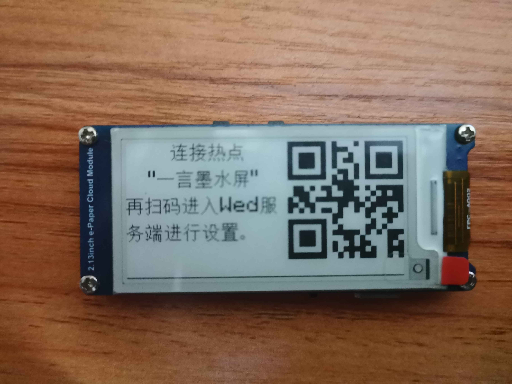

# DeskDecor 桌面摆件

## 简介

使用ESP32控制墨水屏，每隔两分钟更新屏幕上的句子和天气信息（当前天气和气温）。充满电可以运行6天时间。

## 设置

重启设备 5秒內(无法连接WiFi的情況) 按下12pin可以进入设置模式，连接热点 “一言墨水屏”，再扫码进入Wed服务端进行设置。
- 信息刷新间隔时间（分）
- 设备工作时间（当天工作时间，星期几工作）
- 天气信息的经纬度（地理位置）
- 选择句子API（是否循环调用已选API）
- WiFi账号密码（5个）
- 可更换字体文件（替换原有字体bin文件）

## 硬件
[epd2in13_V4](https://www.waveshare.net/wiki/2.13inch_e-Paper_Cloud_Module#.E5.8E.9F.E7.90.86.E5.9B.BE)
- 主控芯片：ESP32(4Mb)
- 墨水屏：2.13寸e-Paper 2in13 V4
- 电源：3.7V 1800mAh电池

## API 依赖

- [一言](https://hitokoto.cn)
- [ONE](https://wufazhuce.com/)
- [青桔](https://api.qjqq.cn/doc-Yi.html)
- [Open-Meteo](https://open-meteo.com)

## 数据生成依赖

字体数据文件（FontFunction.h, FontData.bin）生成使用的是[TestRoutineSet - TTF_bin](https://github.com/wuxingwushu/TestRoutineSet/tree/main/TTF_bin)的Freetype测试程序

图片数据文件（ImageData.h）生成使用的是[TestRoutineSet - Dithering](https://github.com/wuxingwushu/TestRoutineSet/tree/main/Dithering)的Freetype测试程序

# 效果
## 每隔2分钟更新显示内容

## 没有WIFI时显示储存的图片

## 开始Wed服务模式进行设置

## 基础设置界面

